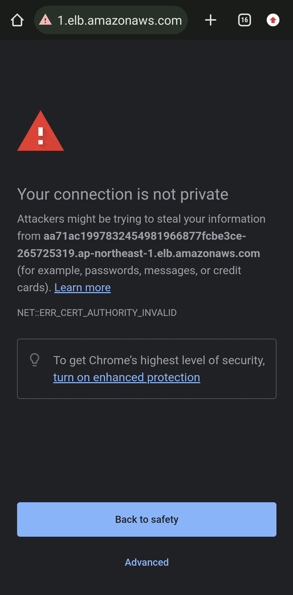

# devops-infra
This is a demonstration of cicd project ( Jenkins and ArgoCD )

This link with two repositories :
* [devops-vue](https://github.com/haquocdat543/devops-vue.git)
* [devops-argocd](https://github.com/haquocdat543/devops-argocd.git)

## Infra Components
* [Backend](https://github.com/haquocdat543/devops-infra/tree/main/backend) ( standard )
* [Eks-cluster](https://github.com/haquocdat543/devops-infra/tree/main/eks) ( 3 nodes )
* [Jenkins-server](https://github.com/haquocdat543/devops-infra/tree/main/jenkins) ( 3 servers )
  * Jenkin-master ( java, jenkins )
  * Jenkin-agent ( java, docker, nodejs, npm, vuecli, trivy )
  * Sonarqube-server ( docker, sonarqube )
## Prerequisites
* [git](https://git-scm.com/downloads)
* [kubectl](https://kubernetes.io/docs/tasks/tools/)
* [terraform](https://developer.hashicorp.com/terraform/tutorials/aws-get-started/install-cli)
* [awscli](https://docs.aws.amazon.com/cli/latest/userguide/getting-started-install.html)
* [config-profile](https://docs.aws.amazon.com/cli/latest/reference/configure/)
* [github-token](https://docs.github.com/en/enterprise-server@3.9/authentication/keeping-your-account-and-data-secure/managing-your-personal-access-tokens) ( allow access to `argocd-repo` and `frontend-backend repo` )

## Start
### 1. Clone project
```
git clone https://github.com/haquocdat543/devops-infra.git
cd devops-infra
```
### 2. Backend
```
cd backend
terraform init
terraform apply --auto-approve
```
#### 1. Enter value

```
Terraform has been successfully initialized!
You may now begin working with Terraform. Try running "terraform plan" to see
any changes that are required for your infrastructure. All Terraform commands
should now work.
If you ever set or change modules or backend configuration for Terraform,
rerun this command to reinitialize your working directory. If you forget, other
commands will detect it and remind you to do so if necessary.
var.project
  The project name to use for unique resource naming
  Enter a value:
```
You just need to enter you backend name. Ex: your name

#### 2. Output:
```
Outputs:
config = {
  "bucket" = "hqd-s3-backend"
  "dynamodb_table" = "hqd-s3-backend"
  "region" = "ap-northeast-1"
  "role_arn" = "arn:aws:iam::095368940515:role/HqdS3BackendRole"
}
[root@ip-172-31-47-29 backend]#
```
keep it elsewhere, we will use it later.
### 3. EKS
Change directory to `eks`
```
cd ../eks
```
#### 1. Modified backend

Before we initialize it we need to modified `main.tf` file in eks folder use `output` of backend
```
terraform {
  backend "s3" {
    bucket         = "hqd-s3-backend"
    key            = "Eks/terraform.tfstate"
    region         = "ap-northeast-1"
    encrypt        = "true"
    role_arn       = "arn:aws:iam::095368940515:role/HqdS3BackendRole"
    dynamodb_table = "hqs-s3-backend"
  }
}
```
#### 2. Initialize Eks cluster
```
terraform init
terraform apply --auto-approve
```
Outputs:
```
endpoint = "https://0BA23B64A316C8241778E514A15DA062.gr7.ap-northeast-1.eks.amazonaws.com"
```
#### 3. Update kubeconfig
If you modified `eks cluster name` in main.tf you need to change below command follow you eks cluster name.
```
aws eks update-kubeconfig --name my-eks
```
#### 4. Install ArgoCD
```
kubectl create namespace argocd
kubectl apply -n argocd -f https://raw.githubusercontent.com/argoproj/argo-cd/stable/manifests/install.yaml
```
#### 5. Expose ArgoCD service to Internet
```
kubectl patch svc argocd-server -n argocd -p '{"spec": {"type": "LoadBalancer"}}'
```
#### 6. Get loadbalancer dns name
```
kubectl config set-context --current --namespace argocd
kubectl get svc 
```
Output:
```
[root@ip-172-31-47-29 eks]# kubectl get svc
NAME                                      TYPE           CLUSTER-IP       EXTERN
AL-IP                                                                   PORT(S)
                     AGE
argocd-applicationset-controller          ClusterIP      172.20.151.199   <none>
                                                                        7000/TCP
,8080/TCP            18s
argocd-dex-server                         ClusterIP      172.20.23.92     <none>
                                                                        5556/TCP
,5557/TCP,5558/TCP   18s
argocd-metrics                            ClusterIP      172.20.76.23     <none>
                                                                        8082/TCP
                     18s
argocd-notifications-controller-metrics   ClusterIP      172.20.117.174   <none>
                                                                        9001/TCP
                     18s
argocd-redis                              ClusterIP      172.20.92.220    <none>
                                                                        6379/TCP
                     18s
argocd-repo-server                        ClusterIP      172.20.183.168   <none>
                                                                        8081/TCP
,8084/TCP            18s
argocd-server                             LoadBalancer   172.20.93.209    a330c2
0a82437414eaa3d06b6e62a7be-867279894.ap-northeast-1.elb.amazonaws.com   80:32274
/TCP,443:31130/TCP   18s
argocd-server-metrics                     ClusterIP      172.20.33.154    <none>
                                                                        8083/TCP
                     18s
[root@ip-172-31-47-29 eks]#
```
Copy Loadbalancer dns name of `argocd-server` and open in your browser
#### 7. Get argocd password
```
kubectl -n argocd get secret argocd-initial-admin-secret -o jsonpath="{.data.password}" | base64 -d
```



#### 8. Clone repo
```
git clone https://github.com/haquocdat543/devops-argocd.git
cd devops-argocd
```
#### 9. Apply argo app
```
kubectl apply -f argocd.yaml
```
#### 10. Check argocd result


#### 11. Expose app to internet
```
kubectl patch svc myapp-service -n argocd -p '{"spec": {"type": "LoadBalancer"}}'
kubectl get svc
```
Result:


### 4. Servers ( Jenkins-Master, Jenkins-Agent, Sonarqube-Server )

Change directory to `jenkins`
```
cd ../jenkins
```
#### 1. Modified backend

Before we initialize it we need to modified `main.tf` file in jenkins folder use `output` of backend
```
terraform {
  backend "s3" {
    bucket         = "hqd-s3-backend"
    key            = "Eks/terraform.tfstate"
    region         = "ap-northeast-1"
    encrypt        = "true"
    role_arn       = "arn:aws:iam::095368940515:role/HqdS3BackendRole"
    dynamodb_table = "hqs-s3-backend"
  }
}
```
#### 2. Initialize Jenkins
```
terraform init
terraform apply --auto-approve
```

Enter your keyname:
If you dont have it, reference [keypair](https://docs.aws.amazon.com/AWSEC2/latest/UserGuide/ec2-key-pairs.html) to create it
#### 3. Outputs:
```
Jenkins-Agent = "ssh -i ~/Window2.pem ubuntu@13.230.64.196"
Jenkins-Server = "ssh -i ~/Window2.pem ubuntu@35.73.43.3"
Sonarqube-Server = "ssh -i ~/Window2.pem ubuntu@18.178.9.91"
```
#### 4. Configure Sonarqube-server
Copy `<your-sonarqube-server-public-ip>:9000` and open it in your browser

Login with default username `admin` and default password `admin`

Navigate to `top right` corner > `My Account` > `Security` ( second tab )  


Generate token

* Name : Whatever you want
* Expires in : Whatever you want > `Generate` > `Copy`


Navigate to  `Administration` > `Configuration` > `Webhooks` > `Create` > 

* Name : whatever you want
* URL : `<your-jenkins-server-public-ip>:8080/sonarqube-webhook` > `Create`

#### 5. Configure Jenkins-Agent
ssh to Jenkins-Agent and set password to ubuntu user ( you can use ssh key instead )
```
password ubuntu
```
```
password
```
```
confirm password
```
#### 6. Configure Jenkins-Master
Copy `<your-Jenkins-Master-public-ip>:8080` and open it in your browser

ssh to Jenkins-Master and get password
```
sudo cat /var/lib/jenkins/secrets/initialAdminPassword
```
Output will be like this :
```
22daa09214ed43a08902f31917de7b76
```
Copy password and login with default password `admin`


Navigate to `Manage Jenkins` > `Plugins` and Install these plugins :

* Nodejs
* Eclispe Temurin Installer
* Sonarqube scanner
* Docker
* Docker Commons
* Docker Pipeline
* Docker API
* Docker build steps


After install you need to `restart` jenkins to take effect


Navigate to `Manage Jenkins` > `Tools` and configure plugins:

* JDK ( name: jdk17, version: jdk17.0.8+5 )

* Nodejs ( name: node16, version: 16.18.0 ) version allow 16 - 18

* Sonar scanner ( name: sonar, version: Sonarqube Scanner 5.0.1.3006 )

* Docker ( name: docker, version: latest )


Navigate to `Manage Jenkins` > `Credentials` and add some credentials :
* github ( id: github , username: your-github-user-name, password: your-token )

* sonarqube ( id: sonar-server, secret: your-sonar-secret )

* docker ( id: docker, username: your-dockerhub-username, password: your-dockerhub-password )

* ubuntu ( id: ubuntu, ubuntu, password: your-ubuntu-password ) ( You can use ssh key instead )


Navigate to `Manage Jenkins` > `System` and configure it :

* sonarqube ( name: sonar-server, Server-URL: your-sonar-url, Server-authentication-server: your-sonar-token )


Navigate to `Manage Jenkins` > `Nodes` and configure it :

Click add nodes
* Node name: Jenkins-Agent
* Permanent: yes
* Name: Jenkins-Agent
* Number of executors : 2
* Remote root directory : /home/ubuntu
* Labels : Jenkins-Agent
* Launch method : Launch Agent via SSH
* Credentials : ubuntu
* Host Key Verification Strategy : None Verifying Verification Strategy


Click save

Create pipeline

Navigate to `Dashboard` > `new item`
* Name : Every thing you want
* Type: pipeline > `OK`
* Discard old builds :
  * Max # of builds to keep
* Pipeline - definition : Pipeline script from SCM
  * SCM : Git
    * Repository URL : your-repo-link
    * Credential : github
    * Branches to build
      * Branch specifier : main

Click `OK`

Click `Build Now`

### 5. Now let's build version 2

Navigate to your `frontend-backend repo`, in my case it is [devops-vue](https://github.com/haquocdat543/devops-vue.git)

Update it to version 2

In my case :
* I will change content to version 2 in App.vue
* I will change vuev1 to vuev2 in Jenkinsfile
* Stage all changes and commit it


Navigate to `Jenkins server` > `Your pipeline` > `Build now`

Check results :
* Jenkins build


* Dockerhub

* ArgoCD app


* Our vue app


### 6. Destroy
First patch both ( `argocd`, `myapp-service` ) svc to ClusterIP
```
kubectl patch svc argocd-server -n argocd -p '{"spec": {"type": "ClusterIP"}}'
kubectl patch svc myapp-service -n argocd -p '{"spec": {"type": "ClusterIP"}}'
```

Change directory to each folder `backend`, `eks`, `jenkins` and run following commands :
```
terraform destroy --auto-approve
```
